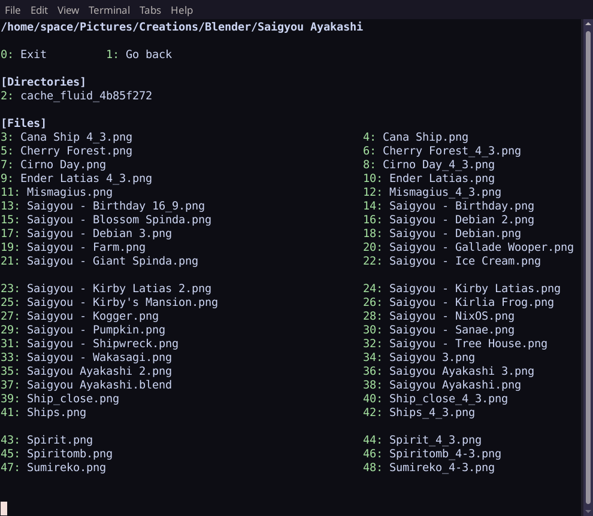

# Parasol
Parasol is a terminal-based (TUI) file explorer and shell.

With Parasol, you can navigate your filesystem, perform file operations, view available disk devices, measure file and directory sizes, execute files, open files with your preferred applications, and run its own built-in shell either alongside the file explorer or standalone.

<p align="center">

</p>


## Download

You can download the latest release of Parasol [here](https://github.com/spacebanana420/parasol/releases).

Download `parasol.jar` and run it with `java -jar parasol.jar`.

For a help screen and list of commands, run Parasol with `-h` or `--help` command-line argument or type `help` while running Parasol.

### Requirements
* Java 11 or newer
* xdg-utils **(for Unix-like systems only) (optional)**
* lsblk (for listing disks on Linux) **(optional)**

Note: for xdg-utils to be optional on unix-like system you must set an appropriate command/program for each file extension in `~/.config/parasol/config.parasol`

### Officially tested systems:
* Linux-based
* FreeBSD
* Haiku

### Systems that should work:
* Other BSD systems (OpenBSD, NetBSD, etc)
* MacOS
* Windows


## Building Parasol

### Using [Yuuka](https://github.com/spacebanana420/yuuka)
```
yuuka package
```

### With a Unix-like shell:
```
mkdir build
javac src/*.java src/*/*.java
cd src
jar cfe ../build/parasol.jar main *.class */*.class
cd ..
```

<p align="center">

</p>
